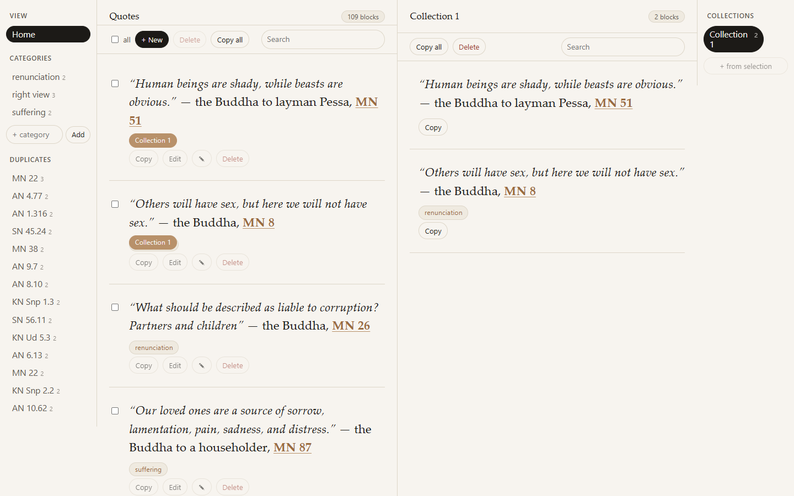

# quotes-manager

<!-- coverage:START -->

<!-- coverage:END -->



A Go 1.26 app for a collection of sutta quotes. `cmd/extract` distills the
quotes embedded in the essay dumps (`dumps/*.txt`) into one canonical format and
a SQLite seed. `cmd/server` is the web app: a single binary that serves the
quotes as editable, rune-sorted blocks persisted in SQLite in real time.

## Directory layout

```
dumps/                         source essays (input, hand-written)
  discerning-truth-from-deception.txt   prose only, no sutta quotes
  sacredness-and-profanity.txt          sutta quotes, inline-cited
  stream-entry-for-lay-buddhists.txt    sutta quotes, inline + header-cited
internal/quote/                parser, normalizer, renderer, near-duplicate detection, seed emitter (+ tests)
internal/search/               pure full-text filter (Terms/Match/Filter) over []store.Quote (+ tests)
internal/store/                SQLite store: CRUD + collections + categories, ordered by char_count
internal/seed/                 EnsureSeeded: canonical seed (+ sample categories) on a fresh database
internal/server/               HTMX handlers + server-rendered templates (+ tests)
internal/coverbadge/           Go-cover parser + README badge renderer (+ tests)
cmd/extract/                   CLI: reads dumps/ and writes database/ + exports/
cmd/server/                    web server: opens + seeds the DB, serves the UI
cmd/coverage/                  CLI: parses a cover profile, refreshes the README badge
cmd/screenshot/                CLI: serves the seeded app in-process, captures docs/home.png
database/
  seed.sql                     generated schema + inserts (committed, embedded)
  quotes.db                    SQLite database (gitignored, created on run)
docs/
  home.png                     README home screenshot (committed, regenerated by `make screenshot`)
exports/
  shortest-first.md            generated export, shortest-first (committed)
web/
  templates/                   layout, rail_left, rail_right, root_zone, collection_zone, collection_list, quote_list, quote_block(_ro), quote_form, quote_chips, quote_collection_chips, quote_category_editor
  static/                      app.css (typography/components) + layout.css (4-zone grid), app.js, htmx (vendored)
go.mod
readme.md
changelog.md
.gitignore
```

## Web application

Run the server (CGO is required for the SQLite driver):

```sh
CGO_ENABLED=1 go run ./cmd/server              # http://localhost:8080
CGO_ENABLED=1 go run ./cmd/server -addr :9000  # custom port
CGO_ENABLED=1 go run ./cmd/server -db /tmp/q.db # custom database path
```

On first run the server creates `database/quotes.db` and loads the canonical
seed (109 quotes, three sample categories, one sample collection). After that
your edits persist; the seed is never reapplied, so deleting a quote is
permanent.

The UI is a dual-pane workspace. A left rail (Home, Categories, Duplicates) and
a right rail (Collections) flank two text columns: the root corpus on the left
and the active collection on the right. Each text column scrolls independently,
so you can keep a different spot open in each. A thin header atop each column
shows only a name and a count. Each root block:

- renders the quote in the canonical format, with passages in italics and the
  sutta id bolded and linked to `https://suttacentral.net/<id-without-spaces>`
  (e.g. `MN 22` to `mn22`), opening in a new tab;
- shows its categories as chips, with an inline editor to tag it;
- shows the collections it belongs to as a second chip row;
- has Copy, Edit, and Delete actions;
- has a checkbox for bulk delete, with a select-all control in the toolbar.

Home is kept in shortest-first (rune-count) order. A newly added quote slots
into its sorted place automatically; there is no drag on home, since home is the
canonical corpus.

New opens a 3-field form (content, attribution, text ID). An empty attribution
defaults to "the Buddha". Copy all copies every quote as one text joined by the
dot separator. Selecting a category or a collection swaps just that pane in
place, and the URL carries `?cat=` or `?col=` for deep linking.

Every mutation is written to SQLite before the UI updates, and the rails and
column counts refresh live via out-of-band swaps. The Duplicates section, the
category and collection counts, and the root "N blocks" header all stay current
without a full reload.

### Collections

Check one or more root quotes and insert gaps (`+` markers) appear between every
pair of collection blocks. Clicking one inserts the selection at that 1-based
position, shifting later items down; duplicates are skipped. "+ from selection"
in the right rail creates a new collection from the selection and makes it
active. Collections are named (inline rename in the right rail) and default to
"Collection {id}" until renamed.

A collection's blocks are copyable (copy-one, copy-all via
`/collections/{id}/export.txt`) and drag-to-reorder, saved to the collection's
own order. They are read-only for content: no New, edit, or delete, so home
stays the sole source of truth. Each collection has a Delete button.

### Categories

Categories are named tags managed independently in the left rail. Create,
rename, or delete them inline; names are unique, case-insensitive. Each root
block shows its categories as chips, and the inline editor toggles any
combination and can create a new category on the spot. Clicking a category (in
the rail or on a chip) filters the root column to its quotes, with Copy all via
`/categories/{id}/export.txt`. Deleting a category untaggs its quotes; deleting
a quote clears its tags.

### Duplicates

The left rail's Duplicates section surfaces near-duplicate quotes: clusters of
two or more passages whose word-level Jaccard similarity exceeds 0.8
(`quote.GroupDuplicates`, joined transitively through a disjoint set, so a group
is a connected component rather than a clique). Grouping is by content, not by
text id: only quotes whose bodies are near-identical are listed, and each row is
labelled with the group's representative (shortest) text id and a member count.
Clicking a group jumps to the representative in the root column, switching to
Home first if a category filter is active, and briefly highlights it. The
canonical seed already contains one such cluster: the `MN 22` trio that differs
only in "Bhikkhus"/"Mendicants" and "sexual"/"sensual". Adding, editing, or
deleting a quote refreshes the section live.

### Search

Each text column has a search box in its toolbar, scoped to the column's active
set: Home or the current category on the left, the active collection on the
right. Typing filters the column in place over htmx (debounced); matching is
case-insensitive, any whitespace-separated word (OR) against the quote body and
citation, with hits wrapped in `<mark>`. `?rq=` and `?cq=` deep-link the two
columns independently. Switching category or collection clears the search.
While a collection search is active the insert gaps and drag handles are hidden,
so a filtered subset cannot be mis-reordered.

### SQLite schema (web)

Home is ordered by `char_count` (rune count), so the table matches the seed
schema:

```sql
CREATE TABLE quotes (
    id          INTEGER PRIMARY KEY,     -- shortest-first rank (canonical)
    sutta_id    TEXT    NOT NULL,
    citation    TEXT    NOT NULL,
    body_md     TEXT    NOT NULL,        -- canonical italicized format
    body_text   TEXT    NOT NULL,
    line_count  INTEGER NOT NULL,
    char_count  INTEGER NOT NULL,        -- rune count; home is ordered by this
    sources     TEXT    NOT NULL
);
```

`id` and `char_count` carry the canonical shortest-first ranking, which `List`
orders by. Collection order is separate.

Collections are named (or autonumbered) subsets curated from home. Deleting a
quote on home also removes it from every collection:

```sql
CREATE TABLE collections (
    id   INTEGER PRIMARY KEY,
    name TEXT NOT NULL DEFAULT ''   -- empty renders as "Collection {id}"
);
CREATE TABLE collection_items (
    collection_id INTEGER NOT NULL,
    quote_id      INTEGER NOT NULL,
    position      INTEGER NOT NULL,    -- 1-based; insert-at-index shifts this
    PRIMARY KEY (collection_id, quote_id)
);
```

Categories are named tags. Deleting a quote clears its tags; deleting a category
untaggs its quotes:

```sql
CREATE TABLE categories (
    id   INTEGER PRIMARY KEY,
    name TEXT NOT NULL UNIQUE COLLATE NOCASE
);
CREATE TABLE category_items (
    category_id INTEGER NOT NULL,
    quote_id    INTEGER NOT NULL,
    PRIMARY KEY (category_id, quote_id)
);
```

`database/seed.sql` and `exports/shortest-first.md` are generated. Regenerate
with `go run ./cmd/extract`. `database/quotes.db` is gitignored; populate it
from the seed with `sqlite3 database/quotes.db < database/seed.sql`. Never
hand-edit generated files.

## Canonical quote format

Every extracted quote is normalized into one format and written to both the
database (`body_md`) and `exports/shortest-first.md`:

```
*"first passage*  
*second passage*  
*last passage"* - **the Buddha, MN 22**
```

- Each passage line is wrapped in italics (`*…*`).
- Lines 1..n-1 end with two spaces (a Markdown line break); there are no blank
  lines between passages of the same quote.
- The last line ends with ` - **<citation>**`, outside the italics.
- `<citation>` keeps the full attribution as found in the source (`the Buddha,
  MN 22`, `the Buddha to layman Pessa, MN 51`, `layman Siha, AN 8.12`). Any
  quote recorded without an attribution is attributed to the Buddha (e.g. `the
  Buddha, AN 4.180`, `the Buddha, SN 55.1`); suttacentral URLs in `( … )` are
  dropped.
- Source curly quotes (`“ ”`) and Pāli diacritics are preserved.

### Separator in the text export

Consecutive quotes in `exports/shortest-first.md` are divided by:

```
.  
.  
.
```

Two blank lines before and after the divider; the first two dots carry two
trailing spaces.

## Extraction rules

The dumps quote suttas in several formats; all are reduced to the canonical
form above (`internal/quote`).

- Inline-cited: a block whose last line ends with ` - <citation>`. Covers
  single-line quotes, multi-line dialog, and narrative-framed passages.
- Header-cited: a lone `SUTTA:` line (e.g. `SN 55.1:`, `MN 13:`); every
  following block becomes the quote's passages until the next header or a `.`
  divider. Such quotes include any framing narrative the essay placed between
  the header and the divider (e.g. `MN 13`).
- Verse with stanza breaks: a quote may span several blank-separated blocks.
  Leading blocks that open with `“` but carry no citation are absorbed into the
  next cited block (e.g. `SN 5.2`).

Per-line cleanup: a leading `(N)` numbering marker and stray `*` / `_` Markdown
artifacts are stripped; the ` - <citation>` tail of the closing line is removed
(it is rendered separately). A citation with no attribution (just the sutta id,
as with all header-cited quotes) is normalized to `the Buddha, <id>`.

Sutta-ID forms recognized: `(DN|MN|AN|SN) N[.N…][-N][#…]`, `KN <sub> N[…]`,
`pli-tv-…#…`, and the abbreviated Vinaya `Tv Vi Bu Pj1`.

### De-duplication, ordering, and counting

- De-dup by normalized passage text (whitespace collapsed). Source-file lists
  are merged; the first-seen citation and sutta id are kept.
- Order shortest-first by rune count of the concatenated passages (stable, with
  deterministic tie-breakers on sutta id then body text). Row `id` equals the
  shortest-first rank.
- Five quotes recur across both essay files (e.g. `AN 8.53`, `MN 117`,
  `SN 20.7`) and are collapsed to one row each.

## SQLite schema

```sql
CREATE TABLE quotes (
    id          INTEGER PRIMARY KEY,     -- shortest-first rank
    sutta_id    TEXT    NOT NULL,        -- canonical id, e.g. "MN 22"
    citation    TEXT    NOT NULL,        -- full kept citation
    body_md     TEXT    NOT NULL,        -- canonical italicized format
    body_text   TEXT    NOT NULL,        -- plain passages joined by newlines
    line_count  INTEGER NOT NULL,
    char_count  INTEGER NOT NULL,        -- rune count of passages (sort key)
    sources     TEXT    NOT NULL         -- ';'-joined dump files
);
```

Indexes on `char_count` and `sutta_id`. Current seed: 109 quotes, char counts
from 51 to 5032.

## Regenerate

```sh
CGO_ENABLED=1 go test ./...   # full test suite (CGO for the SQLite driver)
CGO_ENABLED=1 go vet ./...    # static checks
go run ./cmd/extract          # writes database/seed.sql + exports/shortest-first.md
make coverage                 # recomputes Go test coverage, refreshes the README badge
make screenshot               # serves the seeded app and captures docs/home.png
CGO_ENABLED=1 go run ./cmd/server   # run the web app (http://localhost:8080)
```

To rebuild `database/quotes.db` from a changed `seed.sql`, delete the database
file and restart the server. It re-seeds only an empty or unseeded database:

```sh
rm database/quotes.db && CGO_ENABLED=1 go run ./cmd/server
```

## Notes

- `discerning-truth-from-deception.txt` is prose only. It mentions suttas inline
  (e.g. `AN5.34#7.9`) but contains no citation-terminated block quotes, so it
  contributes zero quotes.
- The Vinaya "black snake" passage appears as `Tv Vi Bu Pj1` in one essay and
  `pli-tv-bu-vb-pj1#5.11.20` in the other with identical text. De-duplication
  collapses them to one row, keeping the first-seen `pli-tv-…` id.
